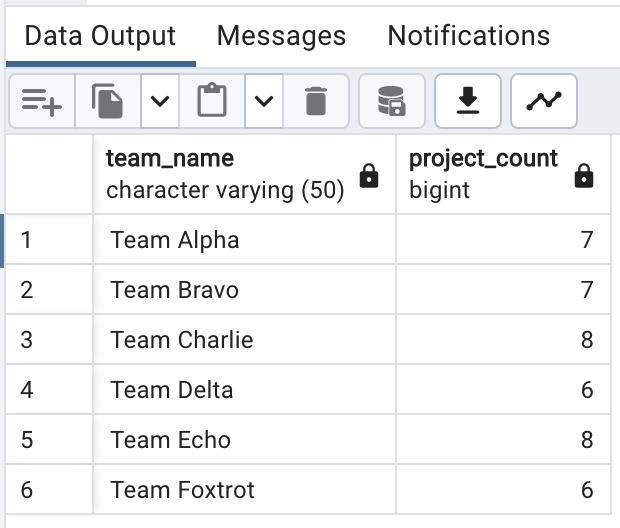
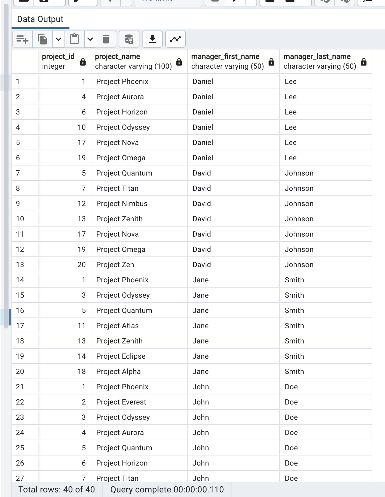
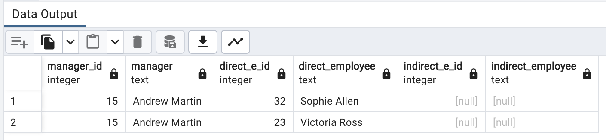
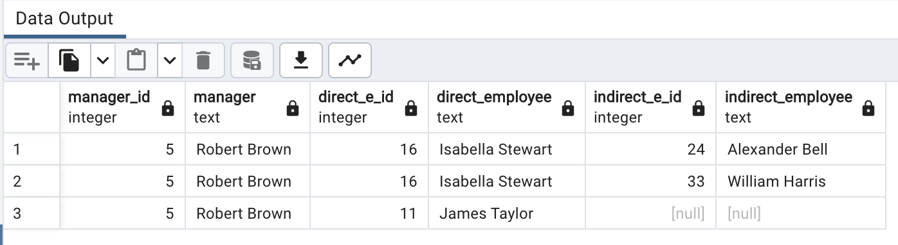
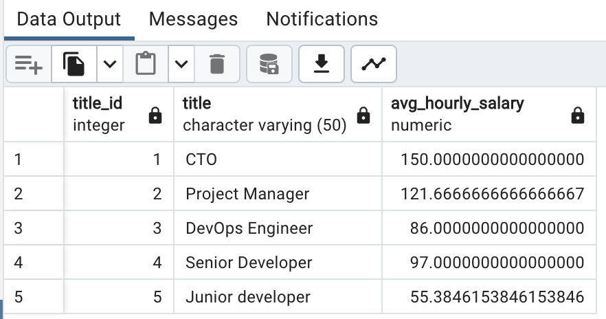
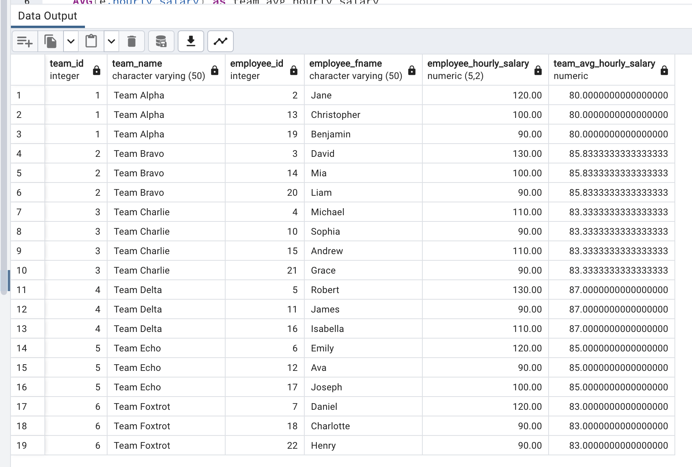
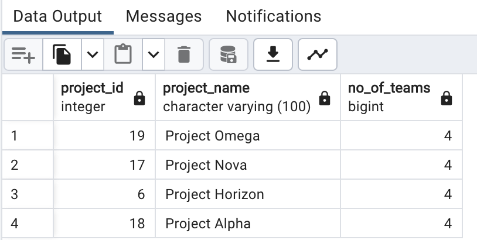
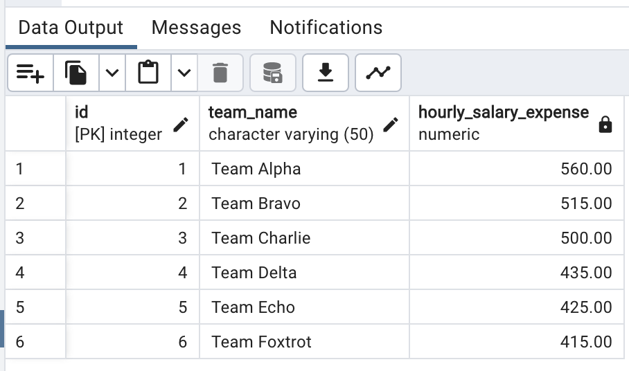

# PostgreSQL Practice Assignment

This practice assignment is designed to help you practice various PostgreSQL clauses, constraints, joins, subqueries, and aggregations using the provided database schema.

## Database Schema

The database schema for this assignment consists of the following tables:

- titles: stores the different titles available for employees.
- employees: stores employee information, including their titles and managers.
- teams: stores team information, including team names and locations.
- projects: stores project information, including project names, clients, start dates, deadlines.
- team_project: a joining table for the many-to-many relationship between teams and projects.
- hour_tracking: tracks the total working hours of employees on various projects, including employee_id, project_id, total_hours

## Requirements

Write the queries to perform these following actions:

In file `createDatabase.sql`, provide the following querries:

- Create database with all tables with the neccessary properties and relationships
- Import data from the csv files to the created tables

In file `retrieval.sql`, provide the following querries:

- Retrieve the team names and their corresponding project count.
- Retrieve the projects managed by the managers whose first name starts with "J" or "D".
- Retrieve all the employees (both directly and indirectly) working under Andrew Martin
- Retrieve all the employees (both directly and indirectly) working under Robert Brown
- Retrieve the average hourly salary for each title.
- Retrieve the employees who have a higher hourly salary than their respective team's average hourly salary.
- Retrieve the projects that have more than 3 teams assigned to them.
- Retrieve the total hourly salary expense for each team.

In file `functions.sql`, provide the functions:

- Create a function `track_working_hours(employee_id, project_id, total_hours)` to insert data into the hour_tracking table to track the working hours for each employee on specific projects. Make sure that data need to be validated before the insertion. Test this function

```
SELECT track_working_hours(20, 7, 40.5);
SELECT track_working_hours(23, 7, 32.25);
SELECT track_working_hours(12, 7, 22.75);
-- and so on...
```

- Create a function `create_project_with_teams` to create a project and assign teams to that project simultaneously. Test this function

```
SELECT create_project_with_teams(
    'New Project',
    'Client XYZ',
    '2023-07-01',
    '2023-12-31',
    ARRAY[1, 2, 3]
);
```

## Queries result
1. Retrieve the team names and their corresponding project count.


2. Retrieve the projects managed by the managers whose first name starts with "J" or "D".


3. Retrieve all the employees (both directly and indirectly) working under Andrew Martin


4. Retrieve all the employees (both directly and indirectly) working under Robert Brown


5. Retrieve the average hourly salary for each title.


6. Retrieve the employees who have a higher hourly salary than their respective team's average hourly salary.


7. Retrieve the projects that have more than 3 teams assigned to them.


8. Retrieve the total hourly salary expense for each team.

